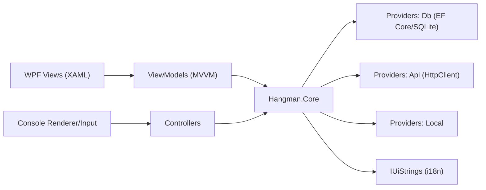
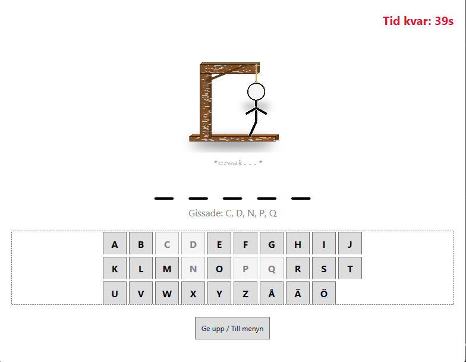
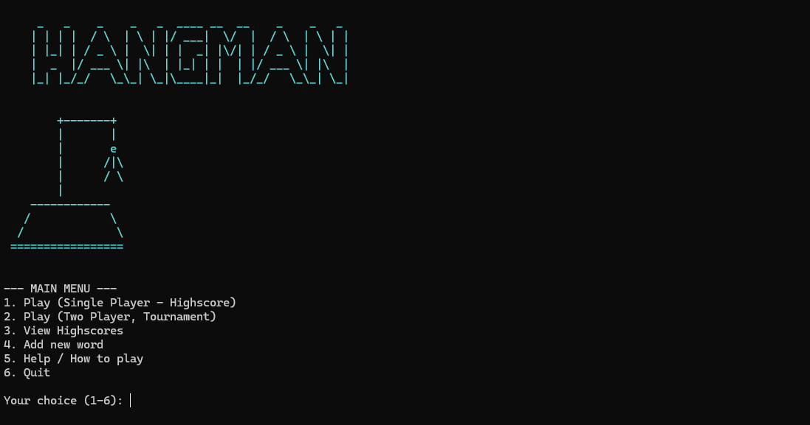

# 🎮 Hangman

[](https://dotnet.microsoft.com/)
[](#-arkitektur)
[](#-testning)

Ett C#-projekt för **Hänga Gubbe** med stöd för både konsol och ett grafiskt **WPF-gränssnitt** byggt med **MVVM**. Projektet använder bland annat Clean Architecture-inspirerad struktur, TDD och stöd för svenska och engelska.

---

## Innehåll

- [Projektstruktur](#-projektstruktur)
- [Mappstruktur](#-mappstruktur)
- [Kom igång (Build & Run)](#-kom-igång-build--run)
  - [Förutsättningar](#förutsättningar)
  - [Köra via Visual Studio (rekommenderat)](#köra-via-visual-studio-rekommenderat)
  - [Köra via kommandoraden (dotnet-cli)](#köra-via-kommandoraden-dotnet-cli)
- [Databashantering](#-databashantering)
- [Funktioner](#-funktioner)
- [Arkitektur](#-arkitektur)
- [Avancerade C#-koncept som används](#-avancerade-c-koncept-som-används)
- [Testning](#-testning)
- [Skärmbilder](#-skärmbilder)
- [Tillgångar (Sprites & Bilder)](#-tillgångar-sprites--bilder)
- [Katalog över viktiga filer](#-katalog-över-viktiga-filer)
- [Projekt & Kurskontext](#-projekt--kurskontext)
- [AI-assistans](#-ai-assistans-och-kodgenerering)

---

## 📁 Projektstruktur

Lösningen är uppdelad i fyra projekt där varje projekt har ett eget ansvar:

| Projekt | Typ | Syfte |
|:---|:---|:---|
| `Hangman.Core` | Class Library | Innehåller spel-logik, modeller, ordkällor, statistik och språkstöd. |
| `Hangman.Console` | Console App | Det körbara konsolbaserade spelet. |
| `Hangman.WPF` | WPF App | Grafiskt gränssnitt byggt med MVVM. |
| `HangmanTest` | xUnit Tests | Enhetstester för `Hangman.Core`. |

---

## 🧱 Mappstruktur

```text
Hangman/
├─ Hangman.Core/
│  ├─ Game.cs                  # Kärnlogik för en spelrunda
│  ├─ TwoPlayerGame.cs         # Logik för turneringsläge (2 spelare)
│  ├─ Models/                  # Datamodeller (HighscoreEntry, CustomWordEntry, ...)
│  ├─ Providers/
│  │  ├─ Db/                   # EF Core (HangmanDbContext, SqliteHangmanService)
│  │  ├─ Api/                  # ApiWordProvider (externa ord via HttpClient)
│  │  └─ Local/                # Lokala och egna ordkällor
│  └─ Localizations/           # IUiStrings, SwedishUiStrings, EnglishUiStrings
│
├─ Hangman.Console/
│  ├─ Program.cs               # Startpunkt för konsolapplikationen
│  ├─ GameController.cs        # Huvudloop och hantering av spelet
│  ├─ ConsoleInput.cs          # Inmatning från användaren
│  └─ ConsoleRenderer.cs       # Utskrift till konsolen
│
├─ Hangman.WPF/
│  ├─ App.xaml(.cs)            # Start, manuell DI och lokalisering
│  ├─ Views/                   # XAML-vyer (MainWindow, GameView, MenuView, ...)
│  └─ ViewModels/              # UI-logik (MainViewModel, GameViewModel, ...)
│
└─ HangmanTest/
   └─ GameTests.cs             # xUnit-tester för kärnlogiken
```

---

## 🚀 Kom igång (Build & Run)

### Förutsättningar

- **.NET 8 SDK** (målram: `net8.0`)
- **Windows** (krävs för WPF)
- **Visual Studio 2022** med workload **“.NET desktop development”**

### Köra via Visual Studio (rekommenderat)

1. Klona repot och öppna **`Hangman.sln`** i Visual Studio.
2. Välj vilket projekt som ska startas:
   - **Konsol:** högerklicka `Hangman.Console` → **Set as Startup Project**
   - **WPF:** högerklicka `Hangman.WPF` → **Set as Startup Project**
3. Tryck **F5** för att starta.

### Köra via kommandoraden (dotnet CLI)

#### Konsol

```bash
cd Hangman/Hangman.Console
dotnet run
```

#### WPF

WPF-versionen kräver Windows:

```bash
cd Hangman/Hangman.WPF
dotnet run
```

---

## 🗄️ Databashantering

Projektet använder **SQLite** tillsammans med **Entity Framework Core**.

- Databasen `Hangman.db` skapas automatiskt vid första körningen.
- `HangmanDbContext` använder `Database.EnsureCreated()`.
- Databasfilen skapas normalt under exempelvis:

```text
bin/Debug/net8.0/
```

Ingen manuell migrering krävs för att komma igång med projektet.

Databasen används bland annat för:

- Highscores
- Egna ord
- Spelarrelaterad statistik

---

## ⚙️ Funktioner

- **Två gränssnitt** – spela via konsol eller WPF.
- **Flerspråksstöd** – växla mellan svenska och engelska.
- **SQLite + EF Core** – highscores och egna ord sparas i `Hangman.db`.
- **Highscore-system** – sparar consecutive wins per spelare och svårighetsgrad.
- **Egna ordlistor** – användaren kan lägga till egna ord på svenska eller engelska.
- **Turneringsläge** – två spelare med tre liv var.
- **Speltimer** – 60 sekunder per runda i både singleplayer och tournament.
- **Flexibel ordhantering** – ord kan hämtas asynkront från API, databas eller lokala ordkällor.
- **API-integration** – engelska ord kan hämtas från ett externt API.
- **Separering av konsollogik** – `ConsoleInput` och `ConsoleRenderer` håller inmatning och rendering separerade från spellogiken.

---

## 🧱 Arkitektur

Projektet är uppdelat så att spellogiken ligger separat från de olika gränssnitten.



### MVVM

WPF-applikationen använder MVVM för att separera gränssnittet från logiken.

- **View** – XAML-vyerna som användaren ser.
- **ViewModel** – hanterar UI-logik och data binding.
- **Model/Core** – innehåller själva spelreglerna och datamodellerna.

### Clean Architecture

`Hangman.Core` innehåller den centrala spellogiken och är inte beroende av WPF- eller konsolprojektet.

Det gör att samma spel-logik kan användas från både konsolapplikationen och WPF-applikationen.

### Strategy Pattern

Strategy Pattern används bland annat för:

- `IAsyncWordProvider` – olika sätt att hämta ord.
- `IUiStrings` – olika språk.

Det gör att ordkälla och språk kan bytas utan att ändra den centrala spellogiken.

### Manuell Dependency Injection

Projektet använder manuell DI där tjänster och providers skapas i:

- `App.xaml.cs` för WPF
- `Program.cs` för Console

---

## 🧩 Avancerade C#-koncept som används

| Område | Exempel i koden | Förklaring |
|:---|:---|:---|
| **Asynkron programmering** | `async Task RunAsync()`, `await _wordProvider.GetWordAsync()` | Används bland annat vid hämtning av ord, timers och UI-händelser. |
| **Data Binding (MVVM)** | `INotifyPropertyChanged`, `ICommand` | ViewModels meddelar UI:t när data ändras och knappar kopplas till kommandon. |
| **Events & Delegates** | `Game.GameEnded += OnGameEnded` | Spelet kan meddela UI-lagret när exempelvis en runda avslutas. |
| **Strategy Pattern** | `IUiStrings`, `IAsyncWordProvider` | Gör det möjligt att byta språk och ordkälla utan att ändra spel-logiken. |
| **LINQ** | `context.Highscores.OrderBy(...).Take(n)` | Används för filtrering och sortering av data. |
| **Collections** | `HashSet<char>`, `ObservableCollection<T>` | `HashSet` används bland annat för gissningar och `ObservableCollection` för listor i WPF. |
| **Anpassad felhantering** | `NoCustomWordsFoundException` | Eget undantag som används när det saknas anpassade ord. |

---

## 🧪 Testning

Projektet använder **xUnit** för enhetstester.

**Testprojekt:** `HangmanTest`

**Testfil:** `HangmanTest/GameTests.cs`

Tester finns bland annat för:

- Initiering av spel
- Rätta och felaktiga gissningar
- Dubbelgissningar
- Vinst- och förlustvillkor
- Eventflöden
- Tomma ord
- Specialtecken
- Case-insensitivity

### Köra tester

Kör följande kommando från solutionens rot:

```bash
dotnet test
```

---

## 🖼️ Skärmbilder

### Hangman.WPF – GameView



### 🎬 Demo

<div align="left">
  <video src="https://github.com/user-attachments/assets/b7c3f18a-ba00-4da4-97ac-13a98c06783e" autoplay loop muted playsinline width="250"></video>
</div>

### Hangman.Console – ConsoleMenu



### 🎬 Demo

<div align="center">
  <video src="https://github.com/user-attachments/assets/976fce42-e14e-4362-ba39-a99f11b3ee19" autoplay loop muted playsinline width="250"></video>
</div>

---

## 📚 Katalog över viktiga filer

<details>
<summary><strong>Hangman.Core</strong></summary>

- `Game.cs` – Spelregler och rundlogik
- `TwoPlayerGame.cs` – Turneringsläge med två spelare och livsystem
- `Providers/Db/` – `HangmanDbContext` och `SqliteHangmanService`
- `Providers/Api/ApiWordProvider.cs` – Hämtar ord via `HttpClient`
- `Localizations/` – `IUiStrings`, `SwedishUiStrings` och `EnglishUiStrings`

</details>

<details>
<summary><strong>Hangman.WPF</strong></summary>

- `App.xaml(.cs)` – Start, DI och språkinställningar
- `Views/` – `MainWindow.xaml`, `GameView.xaml`, `MenuView.xaml`, ...
- `ViewModels/` – `MainViewModel`, `GameViewModel`, `HighscoreViewModel`, ...

</details>

<details>
<summary><strong>Hangman.Console</strong></summary>

- `Program.cs` – Startpunkt för konsolapplikationen
- `GameController.cs` – Hanterar spel-loopen
- `ConsoleInput.cs` – Hanterar användarens inmatning
- `ConsoleRenderer.cs` – Hanterar utskrift till konsolen

</details>

---

## 👥 Projekt & Kurskontext

Detta projekt utvecklades i samarbete med en annan student som en del av kursen:

**Avancerad programmering med C# (7,5 hp)**  
(*Advanced C# Programming, 7.5 credits*)

Projektet genomfördes som ett pararbete där fokus låg på att använda C#-funktioner och designmönster i ett större projekt.

### 🎯 Fokus i projektet

Arbetet omfattade bland annat:

- Asynkron programmering och events
- Designmönster som Strategy Pattern och MVVM
- Testning med xUnit
- Databashantering med EF Core och SQLite
- Utveckling av både konsolapplikation och WPF-gränssnitt
- Separation av spellogik och användargränssnitt

### 🧠 Erfarenheter

Under projektet fick vi bland annat arbeta med:

- Objektorienterad och avancerad C#-utveckling
- Asynkron programmering
- WPF och MVVM
- Enhetstestning med xUnit
- EF Core och SQLite
- Designmönster och projektstruktur
- Att använda samma kärnlogik från flera olika gränssnitt

---
## 📜 License

Detta projekt distribueras under **MIT License**.

```text
MIT License

Copyright (c) 2025 Hangman

Permission is hereby granted, free of charge, to any person obtaining a copy
of this software and associated documentation files (the "Software"), to deal
in the Software without restriction, including without limitation the rights
to use, copy, modify, merge, publish, distribute, sublicense, and/or sell
copies of the Software, and to permit persons to whom the Software is
furnished to do so, subject to the following conditions:

The above copyright notice and this permission notice shall be included in all
copies or substantial portions of the Software.

THE SOFTWARE IS PROVIDED "AS IS", WITHOUT WARRANTY OF ANY KIND, EXPRESS OR
IMPLIED, INCLUDING BUT NOT LIMITED TO THE WARRANTIES OF MERCHANTABILITY,
FITNESS FOR A PARTICULAR PURPOSE AND NONINFRINGEMENT. IN NO EVENT SHALL THE
AUTHORS OR COPYRIGHT HOLDERS BE LIABLE FOR ANY CLAIM, DAMAGES OR OTHER
LIABILITY, WHETHER IN AN ACTION OF CONTRACT, TORT OR OTHERWISE, ARISING FROM,
OUT OF OR IN CONNECTION WITH THE SOFTWARE OR THE USE OR OTHER DEALINGS IN THE
SOFTWARE.
```


---

## 🤖 AI-assistans och kodgenerering

AI-verktyg har använts som stöd under utvecklingen av projektet.

### 🛠️ Verktyg som använts

- **ChatGPT** – hjälp med algoritmer, problemlösning och dokumentation.
- **Copilot** – autokomplettering, boilerplate och tester.

### 🎯 Hur AI användes

AI användes bland annat för:

- Förslag på implementationer och algoritmer.
- Boilerplate-kod och klassstruktur.
- Felsökning.
- Tester.
- Dokumentation.

### 👁️ Mänsklig granskning

Kod som genererats med hjälp av AI har granskats och testats manuellt innan den använts i projektet.

Projektgruppen ansvarar för den slutliga koden och implementationen.

---
