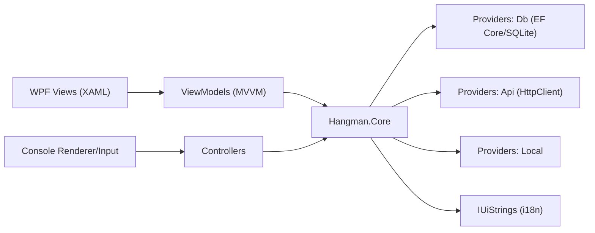

# 🎮 Hangman

[](https://dotnet.microsoft.com/)
[](#-arkitektur)
[](#-testning)

A C# project for **Hangman** with support for both console and a graphical **WPF interface** built using **MVVM**. The project uses a Clean Architecture-inspired structure, TDD, and support for both Swedish and English.

---

## Contents

- [Project Structure](#-project-structure)
- [Folder Structure](#-folder-structure)
- [Getting Started (Build & Run)](#-getting-started-build--run)
  - [Prerequisites](#prerequisites)
  - [Running via Visual Studio (recommended)](#running-via-visual-studio-recommended)
  - [Running via the Command Line (dotnet CLI)](#running-via-the-command-line-dotnet-cli)
- [Database Management](#️-database-management)
- [Features](#️-features)
- [Architecture](#-architecture)
- [Advanced C# Concepts Used](#-advanced-c-concepts-used)
- [Testing](#-testing)
- [Screenshots](#️-screenshots)
- [Assets (Sprites & Images)](#-assets-sprites--images)
- [Directory of Key Files](#-directory-of-key-files)
- [Project & Course Context](#-project--course-context)
- [AI Assistance](#-ai-assistance)

---

## 📁 Project Structure

The solution is divided into four projects, each with its own responsibility:

| Project | Type | Purpose |
|:---|:---|:---|
| `Hangman.Core` | Class Library | Contains game logic, models, word providers, statistics, and localization. |
| `Hangman.Console` | Console App | The executable console-based game. |
| `Hangman.WPF` | WPF App | Graphical interface built using MVVM. |
| `HangmanTest` | xUnit Tests | Unit tests for `Hangman.Core`. |

---

## 🧱 Folder Structure

```text
Hangman/
├─ Hangman.Core/
│  ├─ Game.cs                  # Core logic for a game round
│  ├─ TwoPlayerGame.cs         # Logic for tournament mode (2 players)
│  ├─ Models/                  # Data models (HighscoreEntry, CustomWordEntry, ...)
│  ├─ Providers/
│  │  ├─ Db/                   # EF Core (HangmanDbContext, SqliteHangmanService)
│  │  ├─ Api/                  # ApiWordProvider (external words via HttpClient)
│  │  └─ Local/                # Local and custom word providers
│  └─ Localizations/           # IUiStrings, SwedishUiStrings, EnglishUiStrings
│
├─ Hangman.Console/
│  ├─ Program.cs               # Entry point for the console application
│  ├─ GameController.cs        # Main loop and game handling
│  ├─ ConsoleInput.cs          # User input
│  └─ ConsoleRenderer.cs       # Console output
│
├─ Hangman.WPF/
│  ├─ App.xaml(.cs)            # Startup, manual DI, and localization
│  ├─ Views/                   # XAML views (MainWindow, GameView, MenuView, ...)
│  └─ ViewModels/              # UI logic (MainViewModel, GameViewModel, ...)
│
└─ HangmanTest/
   └─ GameTests.cs             # xUnit tests for the core logic
```

---

## 🚀 Getting Started (Build & Run)

### Prerequisites

- **.NET 8 SDK** (target framework: `net8.0`)
- **Windows** (required for WPF)
- **Visual Studio 2022** with the **“.NET desktop development”** workload

### Running via Visual Studio (recommended)

1. Clone the repository and open **`Hangman.sln`** in Visual Studio.
2. Select which project to start:
   - **Console:** right-click `Hangman.Console` → **Set as Startup Project**
   - **WPF:** right-click `Hangman.WPF` → **Set as Startup Project**
3. Press **F5** to start.

### Running via the Command Line (dotnet CLI)

#### Console

```bash
cd Hangman/Hangman.Console
dotnet run
```

#### WPF

The WPF version requires Windows:

```bash
cd Hangman/Hangman.WPF
dotnet run
```

---

## 🗄️ Database Management

The project uses **SQLite** together with **Entity Framework Core**.

- The `Hangman.db` database is created automatically on the first run.
- `HangmanDbContext` uses `Database.EnsureCreated()`.
- The database file is normally created under, for example:

```text
bin/Debug/net8.0/
```

No manual migrations are required to get started with the project.

The database is used for, among other things:

- High scores
- Custom words
- Player-related statistics

---

## ⚙️ Features

- **Two interfaces** – play via the console or WPF.
- **Multilingual support** – switch between Swedish and English.
- **SQLite + EF Core** – high scores and custom words are stored in `Hangman.db`.
- **High-score system** – stores consecutive wins per player and difficulty level.
- **Custom word lists** – users can add their own words in Swedish or English.
- **Tournament mode** – two players with three lives each.
- **Game timer** – 60 seconds per round in both single-player and tournament modes.
- **Flexible word handling** – words can be retrieved asynchronously from an API, database, or local word providers.
- **API integration** – English words can be retrieved from an external API.
- **Separation of console logic** – `ConsoleInput` and `ConsoleRenderer` keep input and rendering separate from the game logic.

---

## 🧱 Architecture

The project is structured so that the game logic is kept separate from the different interfaces.



### MVVM

The WPF application uses MVVM to separate the user interface from the logic.

- **View** – the XAML views displayed to the user.
- **ViewModel** – handles UI logic and data binding.
- **Model/Core** – contains the game rules and data models.

### Clean Architecture

`Hangman.Core` contains the central game logic and does not depend on the WPF or console project.

This allows the same game logic to be used by both the console application and the WPF application.

### Strategy Pattern

The Strategy Pattern is used for, among other things:

- `IAsyncWordProvider` – different ways of retrieving words.
- `IUiStrings` – different languages.

This allows the word provider and language to be changed without modifying the central game logic.

### Manual Dependency Injection

The project uses manual DI, with services and providers created in:

- `App.xaml.cs` for WPF
- `Program.cs` for Console

---

## 🧩 Advanced C# Concepts Used

| Area | Example in Code | Explanation |
|:---|:---|:---|
| **Asynchronous Programming** | `async Task RunAsync()`, `await _wordProvider.GetWordAsync()` | Used for tasks such as retrieving words, timers, and UI events. |
| **Data Binding (MVVM)** | `INotifyPropertyChanged`, `ICommand` | ViewModels notify the UI when data changes, and buttons are connected to commands. |
| **Events & Delegates** | `Game.GameEnded += OnGameEnded` | The game can notify the UI layer when, for example, a round ends. |
| **Strategy Pattern** | `IUiStrings`, `IAsyncWordProvider` | Makes it possible to switch languages and word providers without modifying the game logic. |
| **LINQ** | `context.Highscores.OrderBy(...).Take(n)` | Used for filtering and sorting data. |
| **Collections** | `HashSet<char>`, `ObservableCollection<T>` | `HashSet` is used for guesses, among other things, while `ObservableCollection` is used for lists in WPF. |
| **Custom Exception Handling** | `NoCustomWordsFoundException` | Custom exception used when no custom words are available. |

---

## 🧪 Testing

The project uses **xUnit** for unit testing.

**Test project:** `HangmanTest`

**Test file:** `HangmanTest/GameTests.cs`

Tests cover, among other things:

- Game initialization
- Correct and incorrect guesses
- Duplicate guesses
- Win and loss conditions
- Event flows
- Empty words
- Special characters
- Case insensitivity

### Running Tests

Run the following command from the solution root:

```bash
dotnet test
```

---

## 🖼️ Screenshots

### Hangman.WPF – GameView


### 🎬 Demo

<div align="left">
  <video src="https://github.com/user-attachments/assets/b7c3f18a-ba00-4da4-97ac-13a98c06783e" autoplay loop muted playsinline width="250"></video>
</div>

### Hangman.Console – ConsoleMenu


### 🎬 Demo

<div align="center">
  <video src="https://github.com/user-attachments/assets/976fce42-e14e-4362-ba39-a99f11b3ee19" autoplay loop muted playsinline width="250"></video>
</div>

---

## 📚 Directory of Key Files

<details>
<summary><strong>Hangman.Core</strong></summary>

- `Game.cs` – Game rules and round logic
- `TwoPlayerGame.cs` – Tournament mode with two players and a life system
- `Providers/Db/` – `HangmanDbContext` and `SqliteHangmanService`
- `Providers/Api/ApiWordProvider.cs` – Retrieves words via `HttpClient`
- `Localizations/` – `IUiStrings`, `SwedishUiStrings`, and `EnglishUiStrings`

</details>

<details>
<summary><strong>Hangman.WPF</strong></summary>

- `App.xaml(.cs)` – Startup, DI, and language settings
- `Views/` – `MainWindow.xaml`, `GameView.xaml`, `MenuView.xaml`, ...
- `ViewModels/` – `MainViewModel`, `GameViewModel`, `HighscoreViewModel`, ...

</details>

<details>
<summary><strong>Hangman.Console</strong></summary>

- `Program.cs` – Entry point for the console application
- `GameController.cs` – Handles the game loop
- `ConsoleInput.cs` – Handles user input
- `ConsoleRenderer.cs` – Handles console output

</details>

---

## 👥 Project & Course Context

This project was developed in collaboration with another student as part of the course:

**Advanced C# Programming (7.5 credits)**  
(*Advanced C# Programming, 7.5 credits*)

The project was completed as pair work, with a focus on applying C# features and design patterns in a larger project.

### 🎯 Project Focus

The work covered, among other things:

- Asynchronous programming and events
- Design patterns such as the Strategy Pattern and MVVM
- Testing with xUnit
- Database management with EF Core and SQLite
- Development of both a console application and a WPF interface
- Separation of game logic and user interface

### 🧠 Experience Gained

During the project, we worked with:

- Object-oriented and advanced C# development
- Asynchronous programming
- WPF and MVVM
- Unit testing with xUnit
- EF Core and SQLite
- Design patterns and project structure
- Reusing the same core logic across multiple interfaces

---

## 🤖 AI Assistance and Code Generation

AI tools were used as support during the development of the project.

### 🛠️ Tools Used

- **ChatGPT** – assistance with algorithms, problem-solving, and documentation.
- **Copilot** – autocompletion, boilerplate, and tests.

### 🎯 How AI Was Used

AI was used for, among other things:

- Suggestions for implementations and algorithms.
- Boilerplate code and class structure.
- Debugging.
- Tests.
- Documentation.

### 👁️ Human Review

Code generated with the help of AI was manually reviewed and tested before being used in the project.

The project team is responsible for the final code and implementation.

---
